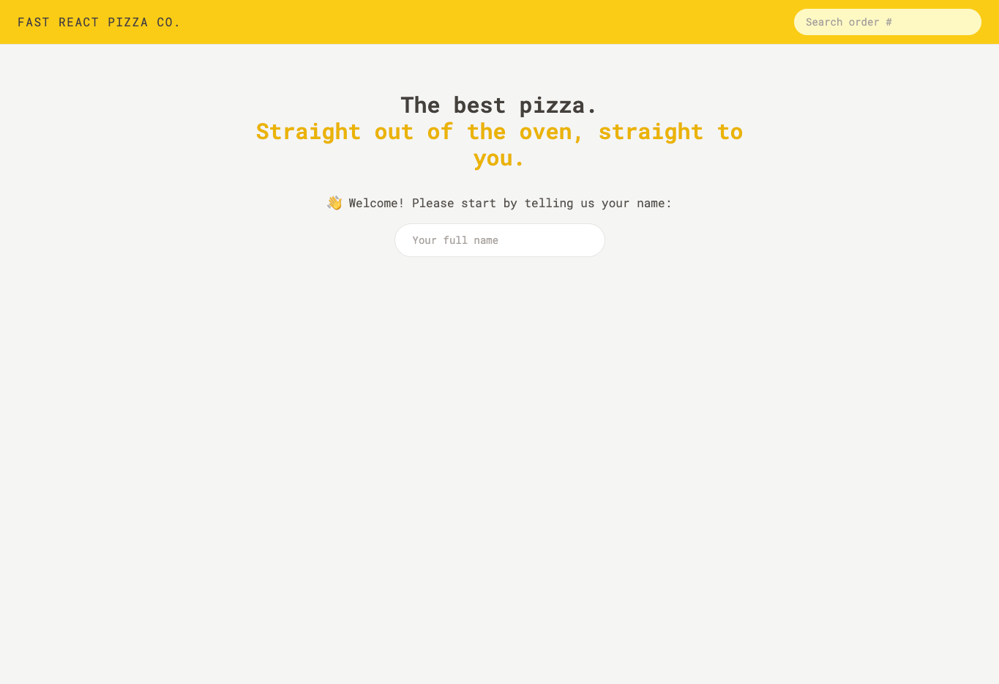
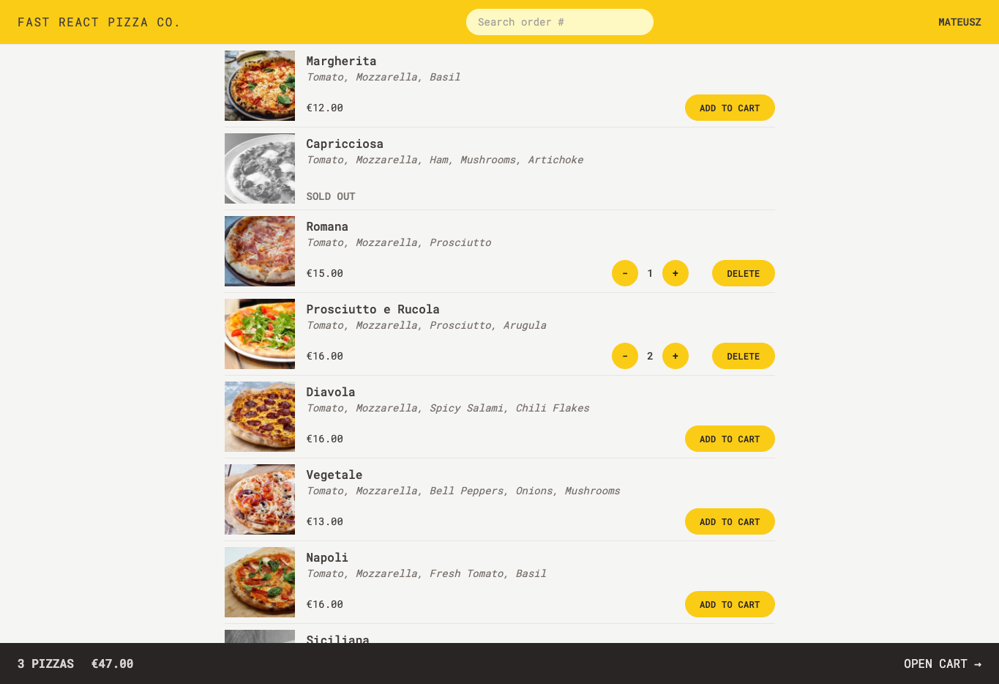
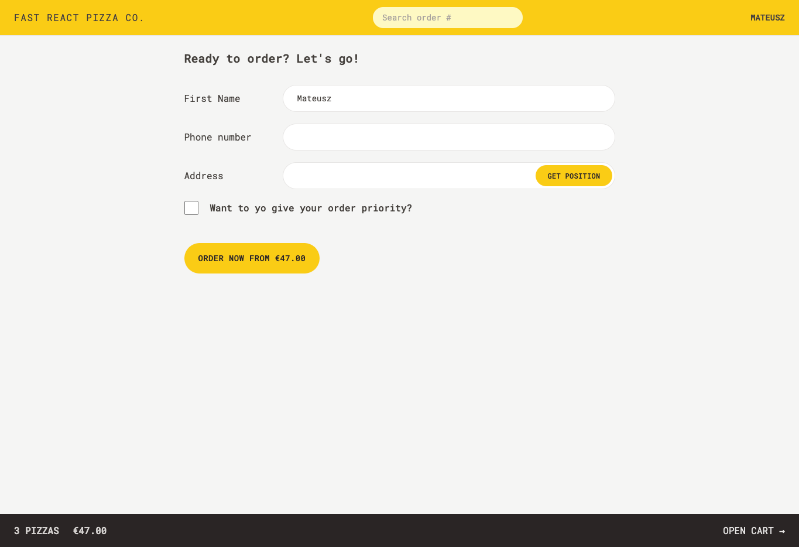
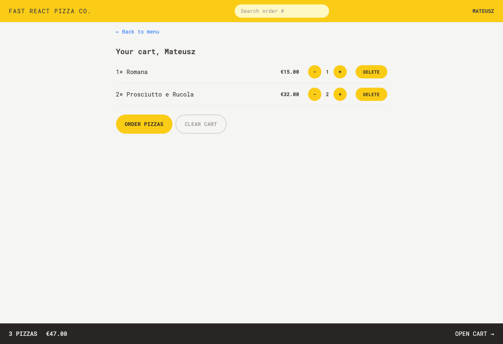

# Fast React Pizza Co.

Fast React Pizza Co. is a Redux project where people can order pizza without authentication.

👉 Live Demo: https://fast-react-pizza-co-lime.vercel.app/cart

# Project requirements from the business

Very simple application, where users can order one or more pizzas from a menu
Requires no user accounts and no login: users just input their names before using the app
The pizza menu can change, so it should be loaded from an API
Users can add multiple pizzas to a cart before ordering
Ordering requires just the user’s name, phone number, and address
If possible, GPS location should also be provided, to make delivery easier
User’s can mark their order as “priority” for an additional 20% of the cart price
Orders are made by sending a POST request with the order data (user data + selected pizzas) to the API
Payments are made on delivery, so no payment processing is necessary in the app
Each order will get a unique ID that should be displayed, so the user can later look up their order based on the ID
Users should be able to mark their order as “priority” order even after it has been placed

# Technologies

React
Tailwindcss
React Router
Redux

# Screenshots of the Project 📸

